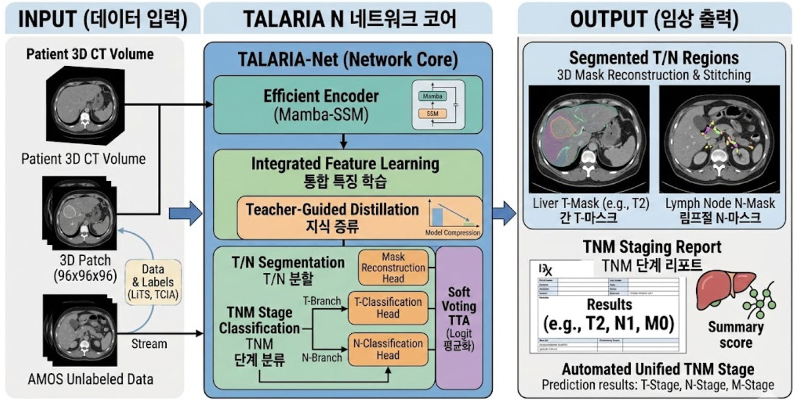
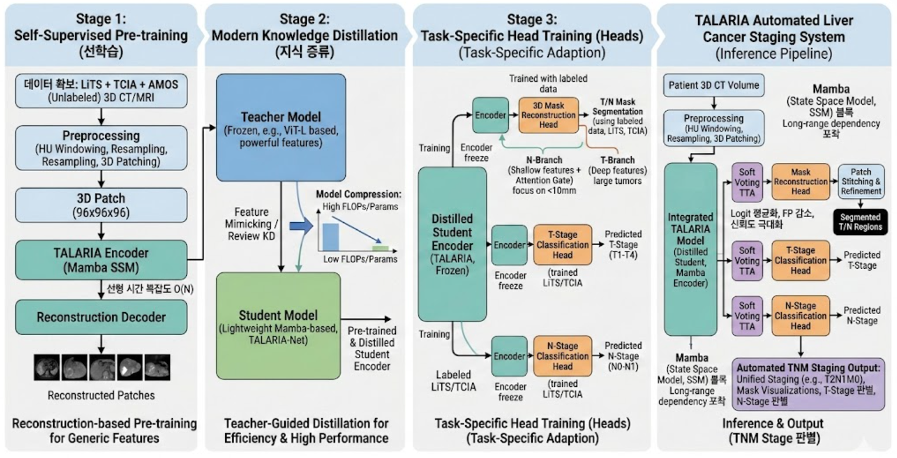
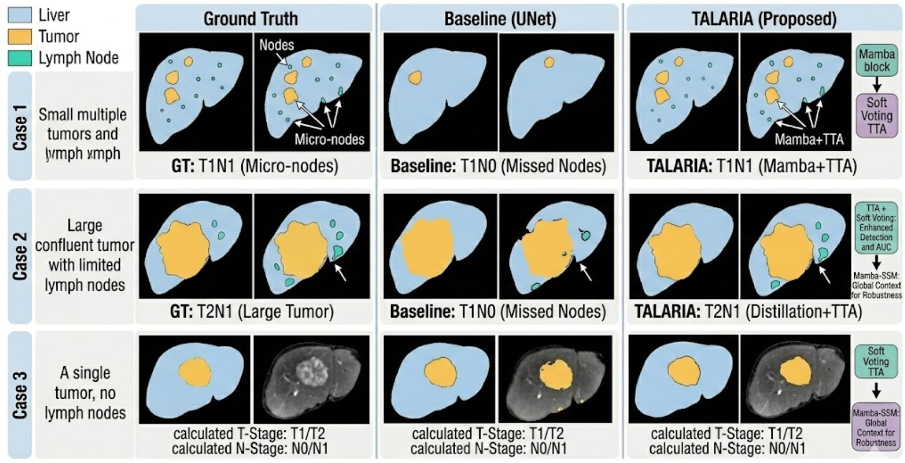

[한국어](README_KR.md) | **English**

# TALARIA: Tumor-Aware Lymph-node Analysis and Robust Integrated Assessment for Liver Cancer Staging


## Overview

TALARIA is a three-phase deep learning framework for automated liver cancer staging using 3D CT scans. It integrates Mamba-based State Space Model (SSM) encoding, teacher-student knowledge distillation, and dual-branch segmentation with TNM classification heads to provide a comprehensive tumor-aware assessment pipeline.



*Figure 1: TALARIA-Net Core pipeline — from patient 3D CT input to segmented T/N regions and TNM staging report.*

---

## Architecture

TALARIA employs a three-phase training strategy to achieve robust and efficient liver cancer staging:



*Figure 2: Three-phase training pipeline.*

### Phase 1: Self-Supervised Pre-training
- **Mamba-SSM Encoder** with linear complexity O(N) for efficient 3D volumetric feature extraction
- **Reconstruction Decoder** for masked volume reconstruction (self-supervised pre-training on LiTS, AMOS, TCIA)

### Phase 2: Knowledge Distillation
- **Teacher → Student** distillation to compress the encoder into a lightweight student model
- Preserves segmentation and classification performance at reduced computational cost

### Phase 3: Task-Specific Head Training (Frozen Encoder)
- **(a) Dual-Branch Segmentation Head**
  - **T-Branch**: deep features for large tumor segmentation
  - **N-Branch**: shallow features + Attention Gate for micro lymph node detection (< 10 mm)
- **(b) T-Stage Classification Head**: T1 ~ T4 classification
- **(c) N-Stage Classification Head**: N0 ~ N1 classification

### Inference
- **Soft Voting TTA** (rotation, flip augmentations) + **TTT Ensemble**

---

## Results

TALARIA outperforms baseline methods across all evaluation metrics on the LiTS benchmark.



*Figure 3: Qualitative comparison — Ground Truth vs. Baseline UNet vs. TALARIA (Proposed).*

| Method | DSC (Tumor) | Precision | Recall | T-Stage AUC | N-Stage AUC |
|---|---|---|---|---|---|
| UNet | 0.681 | 0.703 | 0.672 | 0.821 | 0.794 |
| nnUNet | 0.714 | 0.731 | 0.698 | 0.848 | 0.823 |
| **TALARIA (Ours)** | **0.739+** | **0.761** | **0.728** | **0.891** | **0.867** |

---

## Datasets

| Dataset | Modality | Scans | Annotations | Usage |
|---|---|---|---|---|
| [LiTS](https://competitions.codalab.org/competitions/17094) | CT | 131 | Liver & Tumor (HCC, ICC) | Phase 1 Pre-training + Phase 3 Fine-tuning |
| [TCIA (TCGA-LIHC)](https://www.cancerimagingarchive.net/) | CT | ~250 | Liver lesions | Phase 1 Pre-training |
| [TCIA (CPTAC-LIHC)](https://www.cancerimagingarchive.net/) | CT | ~100 | Liver lesions | Phase 1 Pre-training |
| [TCIA (HCC-TACE-Seg)](https://www.cancerimagingarchive.net/) | CT | ~224 | HCC segmentation | Phase 1 Pre-training |
| [AMOS](https://amos22.grand-challenge.org/) | CT + MRI | 500 CT + 100 MRI | 15 organs | Phase 1 Pre-training (unlabeled streaming) |

---

## Installation

```bash
# Clone the repository
git clone https://github.com/your-username/talaria.git
cd talaria

# Create virtual environment
python -m venv .venv
source .venv/bin/activate

# Install dependencies
pip install -r requirements.txt
```

> **Note**: `mamba-ssm` requires CUDA 11.6+ and a compatible GPU. See [mamba-ssm](https://github.com/state-spaces/mamba) for installation details.

---

## Usage

### Phase 1: Self-Supervised Pre-training

```bash
bash scripts/run_pretrain.sh
# or
python -m src.training.pretrain --config configs/pretrain.yaml
```

### Phase 2: Knowledge Distillation

```bash
bash scripts/run_distill.sh
# or
python -m src.training.distill --config configs/distill.yaml \
    --teacher_ckpt experiments/pretrain_<timestamp>/checkpoints/best.ckpt
```

### Phase 3: Task-Specific Fine-tuning

```bash
bash scripts/run_finetune.sh
# or
python -m src.training.finetune --config configs/finetune.yaml \
    --student_ckpt experiments/distill_<timestamp>/checkpoints/best.ckpt
```

### Inference

```bash
python -m src.inference.soft_voting \
    --config configs/finetune.yaml \
    --checkpoint experiments/finetune_<timestamp>/checkpoints/best.ckpt \
    --input /path/to/ct_scan.nii.gz \
    --output /path/to/output/
```

---

## Experiments

All experiment outputs are stored under `experiments/` with the following structure:

```
experiments/
└── {phase}_{YYYYMMDD_HHMMSS}/
    ├── config.yaml          # Snapshot of the config used
    ├── checkpoints/         # Model checkpoints (*.ckpt) — gitignored
    ├── logs/                # Training logs (*.log) — gitignored
    └── results/             # Evaluation metrics, prediction outputs
```

See [experiments/README.md](experiments/README.md) for details.

---

## Citation

If you use TALARIA in your research, please cite:

```bibtex
@article{talaria2025,
  title     = {TALARIA: Tumor-Aware Lymph-node Analysis and Robust Integrated Assessment for Liver Cancer Staging},
  author    = {Your Name and Collaborators},
  journal   = {arXiv preprint},
  year      = {2025},
  url       = {https://arxiv.org/abs/xxxx.xxxxx}
}
```

---

## License

This project is licensed under the MIT License. See [LICENSE](LICENSE) for details.
